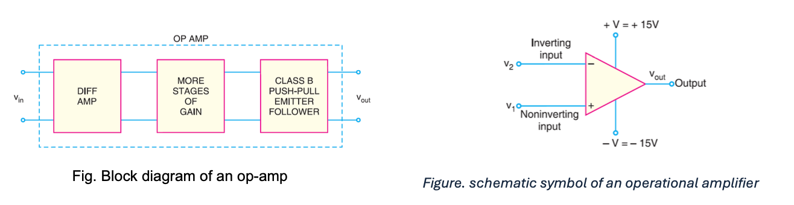
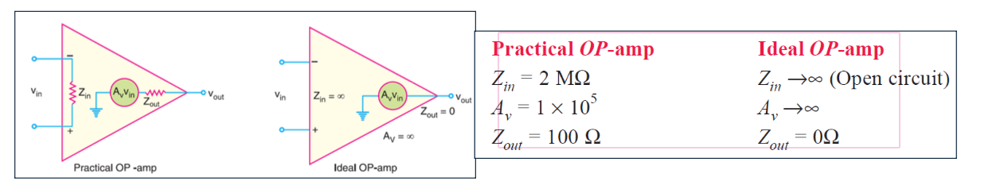
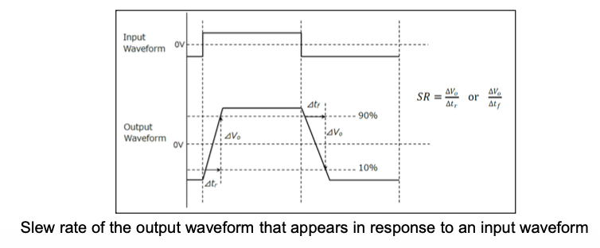

An op-amp is a circuit that can perform mathematical operations such as addition, subtraction, integration and differentiation.

# Op-amp common properties
Important properties common to all op-amps are:
- An operational amplifier is a multistage amplifier. The input stage of an op-amp is a differential amplifier stage
- An inverting input and a noninverting input.
- A high input impedance (usually assumed infinite) at both inputs.
- A low output impedance (< 200 Ω).
- A large open-loop voltage gain, typically 105.
- The voltage gain remains constant over a wide frequency range.
- Very large CMRR (> 90 dB).
# Op-amp terminals
- The basic op-amp has five terminals: two terminals for supply voltages +V and –V; two input terminals (inverting input and noninverting input), and one output terminal.
- The input terminals are marked + and –. These are not polarity signs. The – sign indicates the inverting input, while the + sign indicates the noninverting input.
- A signal applied to the plus terminal will appear in the same phase at the output as at the input. A signal applied to the minus terminal will be shifted in phase by 180°at the output.
> Two other terminals, the offset null terminals, are used to ensure zero output when the two inputs are equal. These are normally used when small d.c. signals are involved.
# Practical  Op-amp
- The characteristics of an ideal Op-amp are: _infinite voltage gain_, _infinite input impedance_ and _zero output impedance_.
- The characteristics of a practical OP-amp are: _very high voltage gain_, _very high input impedance_ and _very low output impedance_.

# Bandwidth of an Op-amp
- All electronic devices work only over a limited range of frequencies. This range of frequencies is called bandwidth. Every op-amp has a bandwidth i.e., the range of frequencies over which it will work properly.
- The bandwidth of an op-amp depends upon the closed-loop gain of the op-amp circuit. An important parameter is the gain-bandwidth product (GBW). It is:
$$GBW=f_{unity}=f_2\times A_{CL}$$
> $A_{CL}$ = closed-loop gain at frequency $f_2$
> $f_{unity}$ = frequency at which the closed-loop gain is unity
> 
- The gain-bandwidth product of an op-amp is **constant**. Since an op-amp is capable of operating as a DC amplifier, its bandwidth is ($f_2 – 0$). GBW of an OP-amp is an important parameter because it can be used to find :
> The maximum value of $A_{CL}$ _(closed-loop voltage gain)_ at a given value of $f_2$. The value of $f_2$ for a given value of $A_{CL}$.
# Slew Rate
- The slew rate of an op-amp is a measure of how fast the output voltage can change and is measured in volts per microsecond (V/μs).
- Example: If the slew rate of an op-amp is 0.5V/μs, it means that the output from the amplifier can change by 0.5 V every μs.
- Since frequency is a function of time, the slew rate can be used to determine the maximum operating frequency of the op-amp as:
$$Maximum\ operating\ frequency,\ f_{max}=\frac{Slew\ rate}{2\pi V_{pk}}$$
> Here $V_{pk}$ is the peak **output voltage**

- SR is a metric used to indicate the speed of a low-to-high or high-to-low transition of the output of an op-amp.
- Generally, SR is defined as a ratio of the time required for the output to change from 10% to 90% or from 90% to 10% of its maximum value to a change in voltage when a high-swing square-wave input is applied.
- Simply, the slew rate is an increase or decrease in voltage that can occur in 1 μs.
- Represents the maximum slope of the output voltage (tangent at the zero-crossing point of a sine wave).
- It defines the highest frequency at which an op-amp can reproduce a given output swing without distortion.
- To ensure proper operation, calculate the required slew rate from the desired output swing and frequency.

- Select an op-amp with a slew rate higher than the calculated requirement.
> an op-amp can be operated at a much higher frequency when being used as a small-signal amplifier than when being used as a large-signal amplifier.
# Frequency Response of an op-amp
The operating frequency has a significant effect on the operation of an op-amp.
- The maximum operating frequency of an op-amp is given by: $f_{max}=\frac{Slew\ Rate}{2\pi V_{pk}}$.
- Thus, the peak output voltage limits the maximum operating frequency.
-  When the maximum operating frequency of an op-amp is exceeded, the result is a distorted output waveform.
- Increasing the operating frequency of an op-amp beyond a certain point will:
> (a) Decrease the maximum output voltage swing, (b) Decrease the open-loop voltage gain, (c) Decrease the input impedance, (d) Increase the output impedance
