4 mian topics:
1. What is System Design and how to do it properly
2. System Design with Static Errors
3. System Design with Dynamic Errors
4. Noise and low noise design
# Introduction to System Design
## What is a System?
**A system**: A set of things working together as parts of a mechanism or an interconnecting network; a complex whole [to implement a defined function]
**Physiology**:A set of organs in the body with a common structure or function. _‘the digestive system’_
**Computing/Electronics**: A group of related hardware units or programs or both, especially when dedicated to a single application.

**System Design**: The process of defining elements of a system like modules, architecture, components and their interfaces and data to realize a function based on the specified requirements.
It is the process of defining, developing, and designing systems which satisfies the specific requirements of a customer or user.
**All Systems consist of**:
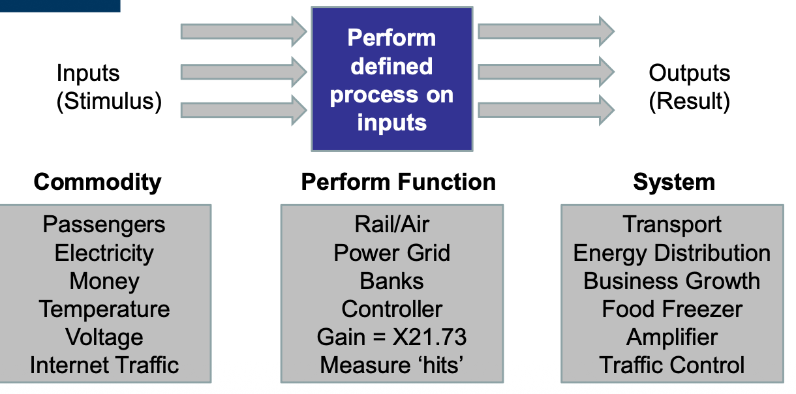
**Sensors System Stack**:
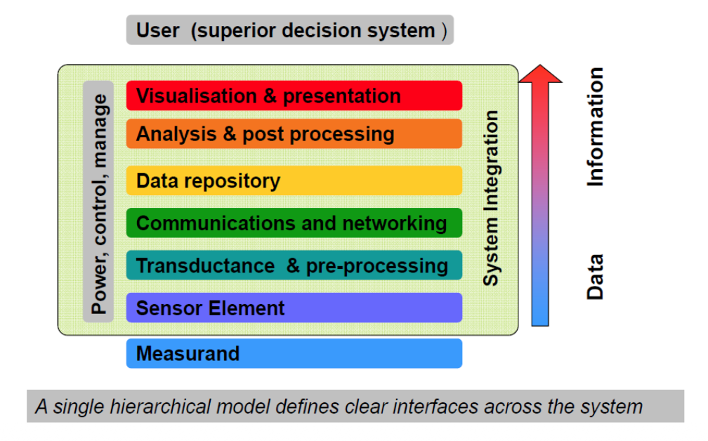
## What is "System Design"?
**ESD is all about Choice and making engineering decisions**
**System Design is Hierarchical: The ‘V’ Model**
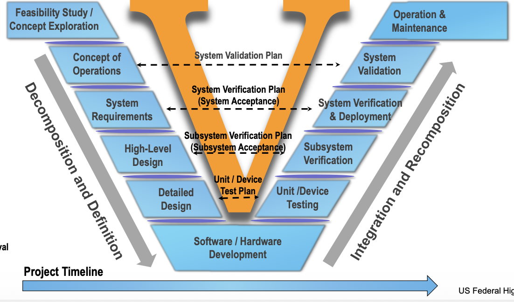
**Electronic Systems Engineering Overview**
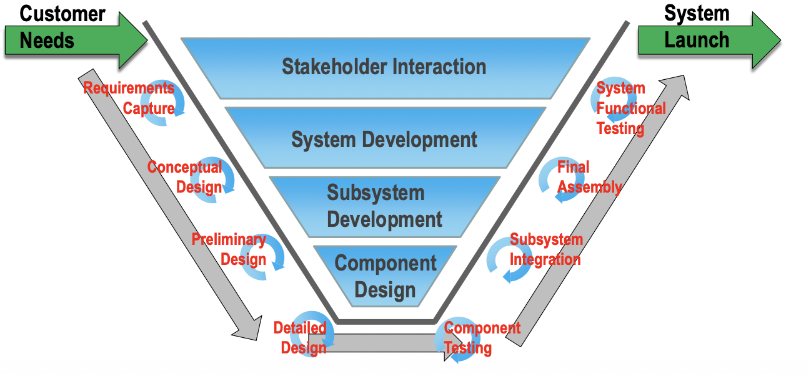
**The secret to good design**
1. **Understand the application**
- WHAT is the customer /user trying to do?
- WHERE is the customer /user trying to do it?
- WHAT accuracy/precision /units is required (10s,1V, 10uA, 10ps…)
2. **Take a holistic (wide) view of the problem**
- Do not ‘rush’ to a solution; spend time UNDERSTANDING
- Try to consider several different approaches to the problem
3. **Approach the problem systematically**
- Use the ‘V’ Model
- Document your decisions: If you discover you were ‘wrong’ you can change the decision and try again.
- Always consider HOW you will **VALIDATE** and **VERIFY** the results
**How to assemble the parts**
We can all access the same parts… the difference is how we use the parts to meet the customer need.
**In ESD, interfaces are key**
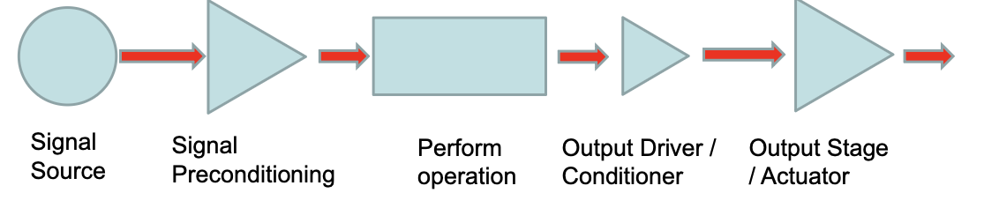
1. Signal Source: Could generate voltage, current, charge, resistance (change of)…
- Question: what Specification describes the input signal?
2. Signal Preconditioning: Amplifying, Filtering (shaping), frequency shifting, limiting…
- Question: what Specification of output is needed?
3. Perform Operation: Could be analog or digital:
- Question: what Specification / accuracy / precision is needed?
4. Output Driver / Conditioner: What is it driving? Specification?
5. Output Stage: What is the interface for output (current drive, voltage drive, fast, slow…)
Specification
A good systems engineer knows their interfaces… as well as internal block functions!!
**Simplified System Block Diagram**
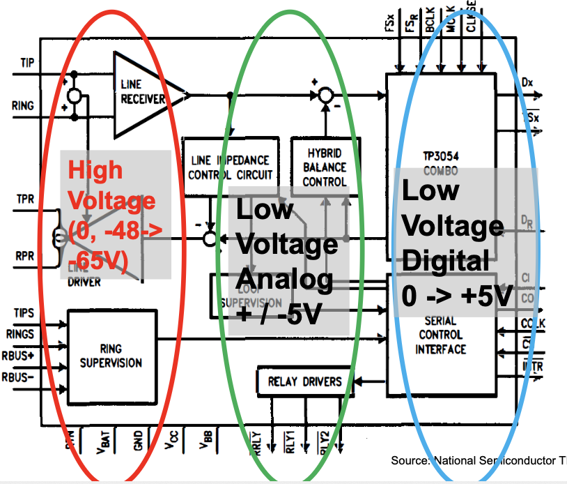
**A board containing many 'systems'**
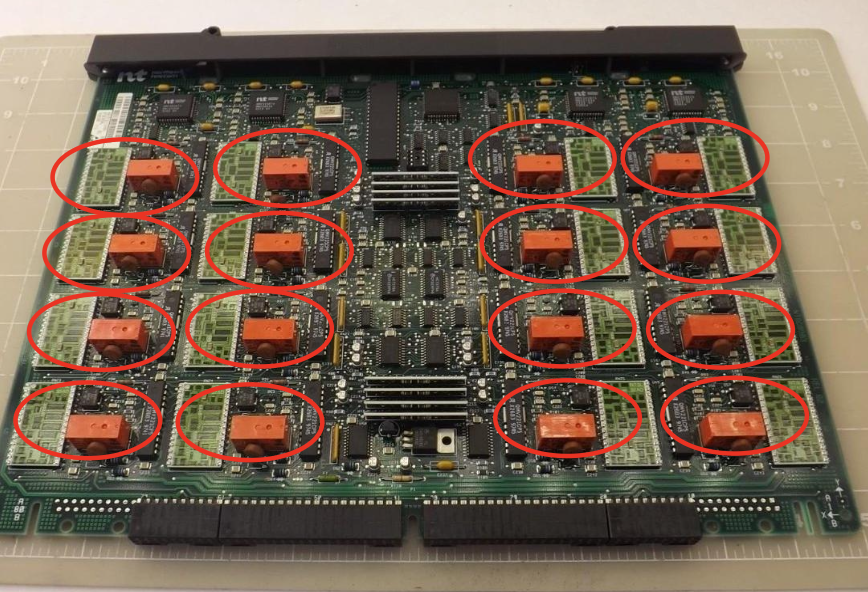
## How to design system?
### Typical Customer Requirement
_‘I want a piece of electronics that will make my voice louder and sound better when I am singing along with my favourite songs on my phone’_
1. It needs to be portable and battery powered
2. It needs a display to tell me how loud I am singing
3. I also want to be able to sell it to lecturers to improve their presentations
4. It must match my iPhone /XiaoMi /Huawei phone colours
5. It must be cheap….
Note: There is no mention of how many volts / amps / watts in this requirement
=> That is your job…
### Hight Level, Concept Design
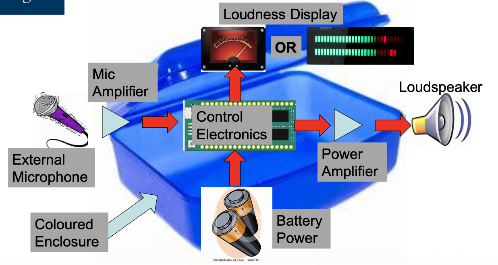
### Examine the signal levels at the interfaces…
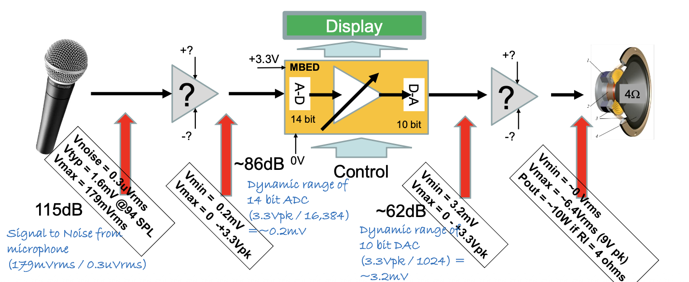
### Identify the problem block(s)...usually the ones with limited performance
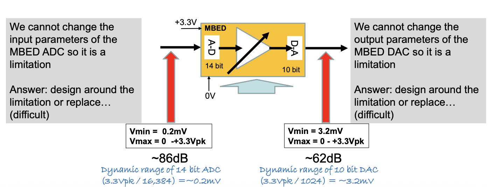
### Examine the signal levels around problem blocks...
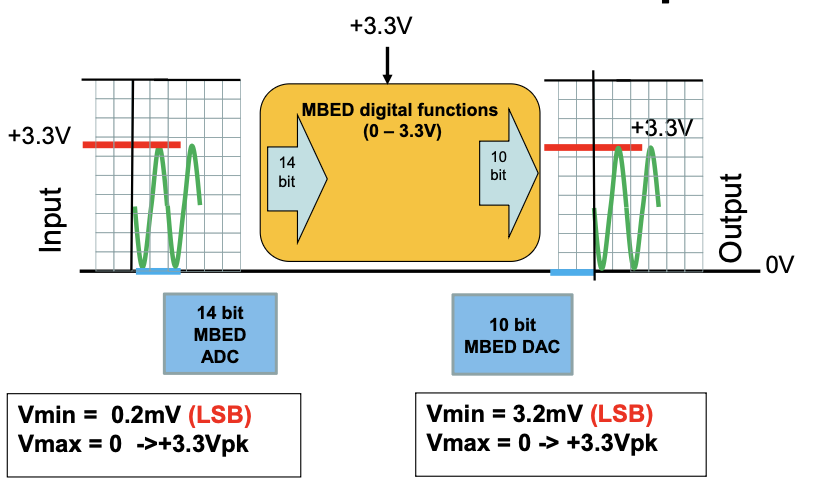
We have 3 key problems:
> Input range of ADC is between 0V and +3.3V
> Audio signals are (usually) centred around 0V (positive and negative peaks). We need to modify our circuit to deal with this; i.e. to accept an input centred around 0V
> The output range of DAC is between 0 and +3.3V; we want to output a signal centred around 0V

### Solve the problems
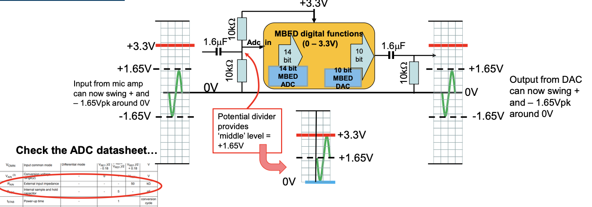
### Introduce the other blocks to the system
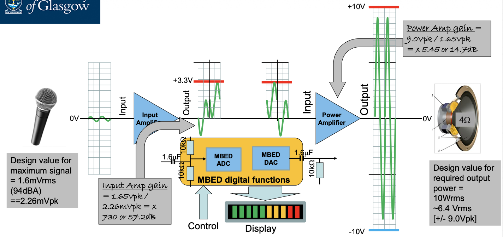
## 6 Rules for System Designers
1. Find out what the customer is trying to do (NOT what they say they want to do!!)
2. Agree a set of requirements with the customer of what you will do to meet their need
3. Think about the WHOLE problem and identify major tasks / functions / blocks you need to perform the task
4. Look at the interfaces; what is happening BETWEEN the blocks
5. Look at the physical limitations (power, signal levels, heat etc)
6. Think about VALIDATION and VERIFICATION; how will you prove you have met the requirements
## Summary of System Engineering
1. System design starts and ends with the customer…
-You must understand the application and the use case of the system
2. It is a hierarchical process and every stage relies on the previous stage
-You must take care throughout the process
3. Validation (doing the right thing), and Verification (does it meet spec) are critical at all stages
-When you are on the left side of the ‘V’ (Decomposition and Definition), you must be thinking how you will test and deliver the final system on the right side of the ‘V’ (Integration and Recomposition)
4. Hardware design /Software design depend on good specifications
## System Engineering : Signal Conditioning
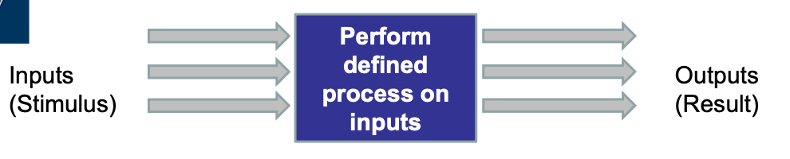
- In **Electronic System Design** we will consider how to provide the best possible input signals to the system. This means signals that are:
> **Accurate**: providing the most accurate signal to the system 
> **Clean**: providing the system with the cleanest, lowest noise signal
> **Immune:** (from disturbance): signals remain accurate and clean when there is interference

- Our course will explore how to deal with low level signals and condition them for the system to use (probably in a digital process)
# Op-Amp Revision
Start with perfect opamp
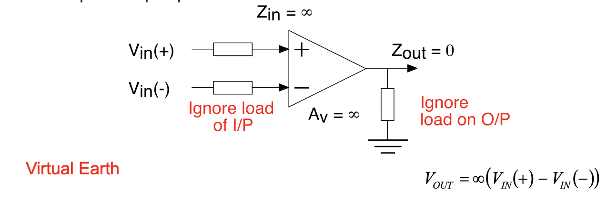
perfect opamp calculation
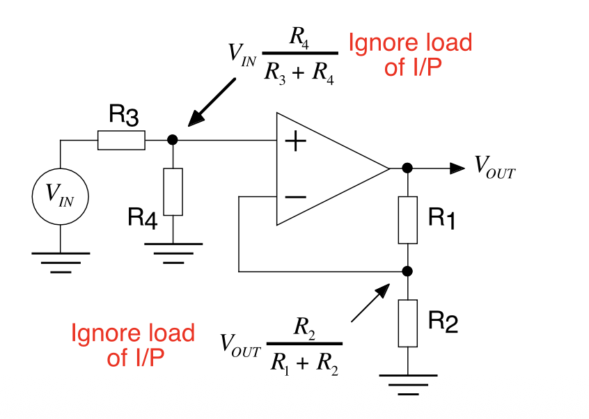
## [Negative Feedback](ESD/ESD_Feedback.md)
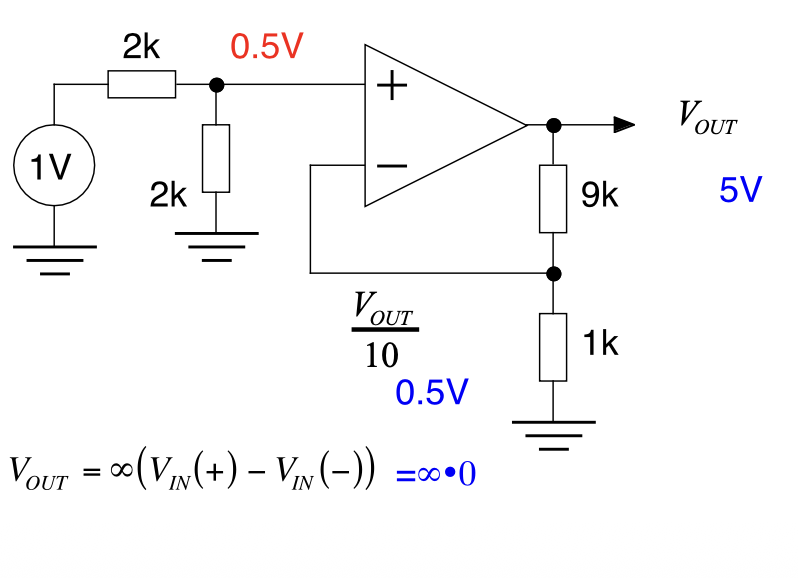
- **Calculate voltage at (+), (–) inputs as a function of**
> Input voltage
> Output voltage
- **Output does** **whatever it takes** **to make input voltages (+) & (–) equal**(虚短)
- **Inputs do not directly change anything**
## Integrator
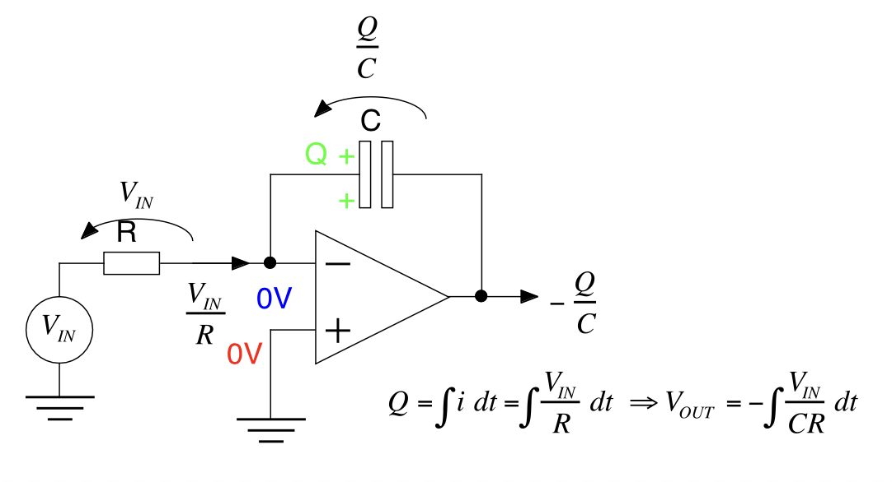
## Opamps are complicated
Compare (standardized) datasheet parameters ($V_{os}, Ib, I_{os}$), don't try and compare schematics; leave that to experts!
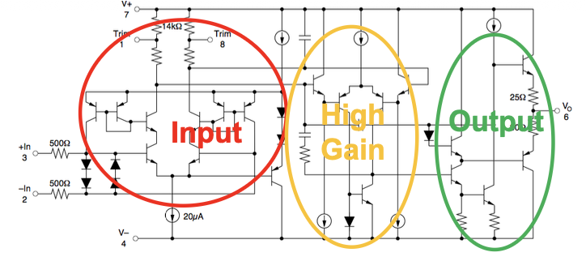
## Perfect opamp calculations are easy (but real opamps are more difficult…)
Method:
1. Opamps are **not** perfect:
> Form a model of an imperfect opamp which is a perfect opamp PLUS additional (ideal) voltage and current sources

2. Calculations still (relatively) easy (perfect opamp plus linear components)
3. Source values become optimisation parameters for system
4. Different circuits can be compared using standard parameters
## System Design = Choice
- No opamp is perfect
- Choice of hundreds of different OpAmps
- Pennies (4p for a dual) -> £371 each
-RS sell a reduced selection of the best opamps in a limited range of grades
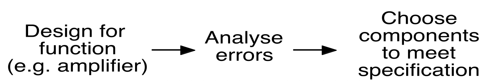
# OpAmp Imperfections
- Imperfections in opamp modelled as Perfect Opamp + sources
- Performance of system is measured against a specification
- ESD is concerned with the methods used to connect the two(Perfect and Imperfect) opamp to produce a design which can be proven to meet specification.
## Imperfect Opamps
- Perfect Opamp: $V_{out}=\infty (V_{IN}(+)-V_{IN}(-))$
- Imperfect Opamp

> 1. Current flows in inputs:
> **Bias**, **Offset**
> 2. Slow:
> [**Bandwidth**, **Slew Rate](ESD/ESD_BW_SR_FR.md)**, **Phase margin**
> 3. O/P has finite impedance (but reduced by feedback)
> 4. Input voltage error:
> **Offset**, [**Common-Mode rejection**, **Power Supply rejection**](ESD/ESD_CMRR_PSRR.md), **Drift (Time / Temperature)**

## How to design with imperfect components
Specify (sub)system
- Function (e.g. Gain of +10)
- External connections (e.g. source voltage range, impedance…)
- Performance (e.g. scale and offset error, bandwidth, power dissipation..)
**1. Naïve design for basic function**
– Full design including choice of opamp, component values…
– Hint: Start with cheap components then work upwards
**2. Analyse circuit for sources of error**
• Identify dominant errors
• Remove/reduce the dominant errors
**3. Optimise your design…**
– Best performance….
– Minimum cost
- **Specification** and **Analysis** are the keys to good design.
## NE5532: Input Stage
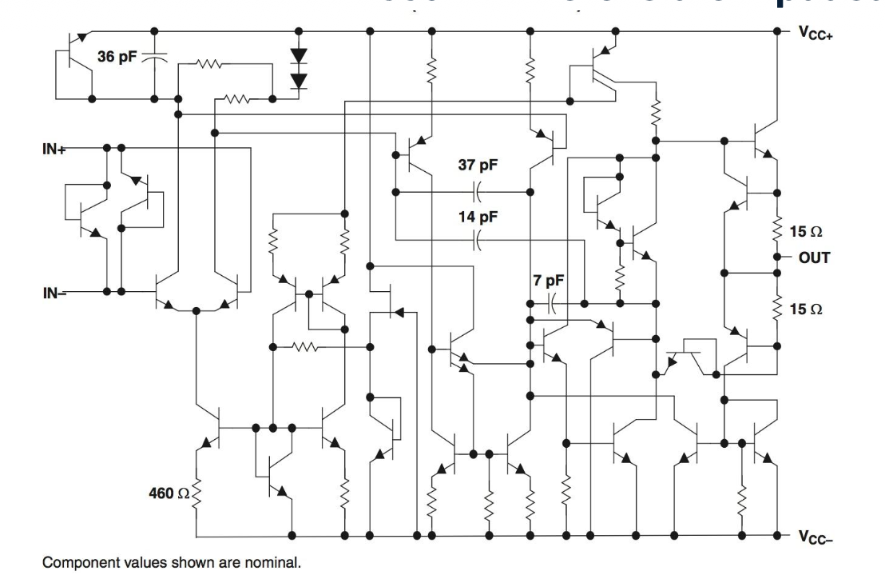
### Input Stage
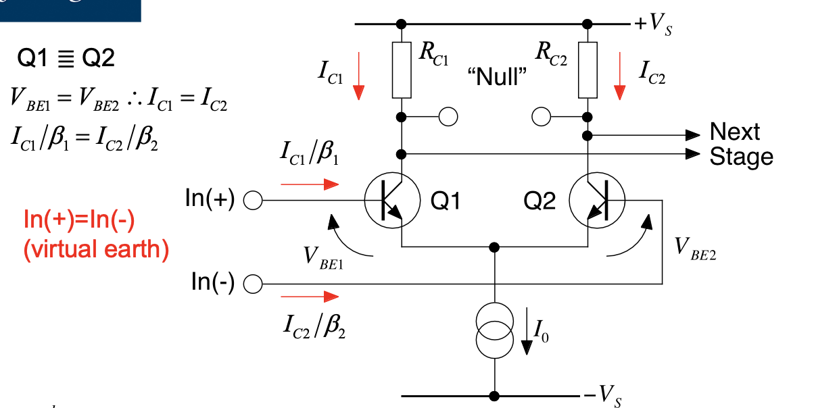
> Because of constant current “tail” total collector current is constant
> Because of matched components and virtual earth principle both input currents are equal
> Input currents are equal and independent of input voltage if negative feedback present; Constant input current
> $$Z_{IN}\approx \infty; i_{IN}≠0$$

### What is inside the NE5532?
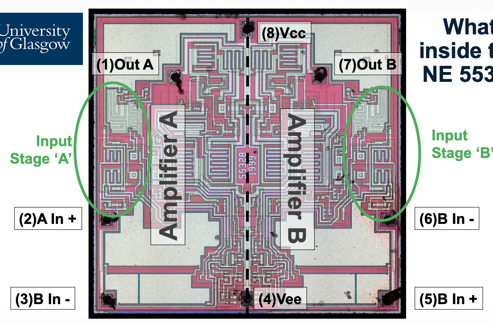
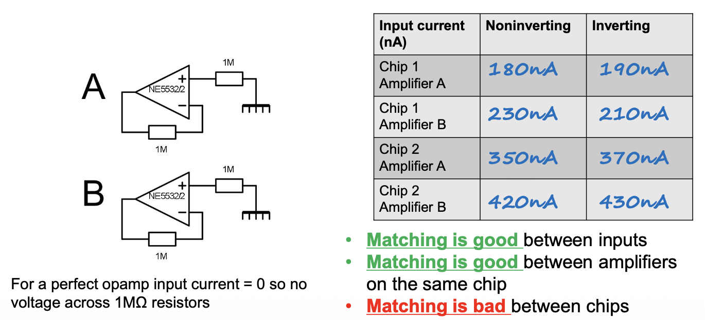
- **同一运放内部匹配良好**：
> 单个运放的**两个输入端之间**（同相与反相）电流匹配较好。
> 同一芯片内的**两个运放之间**（如Amplifier A与B）电流匹配也较好。
- **不同芯片之间匹配较差**：
> 不同芯片（如Chip 1与Chip 2）的输入电流差异显著，匹配性差
- 结论: 
>  在需要高精度或良好匹配的应用中（如仪表放大器、差分电路），**应优先使用同一芯片内的两个运放**，而不是分别来自不同芯片的运放。

## Input Errors
- If transistors are identical
> Differential current depends on difference in inputs
> (Virtual Earth) Input currents (1,2) are equal **= Input Bias Current, $I_B$**
- Collector resistors are equal
> Differential O/P Voltage = 0 for Differential I/P Voltage = 0
$$I_{C1}+I_{C2}\approx I_0\ for\ all\ In(+)orIn(-)$$
- Emitter is connected to a constant current source ($I_B$ is constant with input voltage)
$$\frac{\delta I_B}{\delta V_{IN}}=0;\ R_{IN}=\infty$$
## Imperfect Opamp model (so far)
Perfect Opamp + Current sources = model of a real opamp
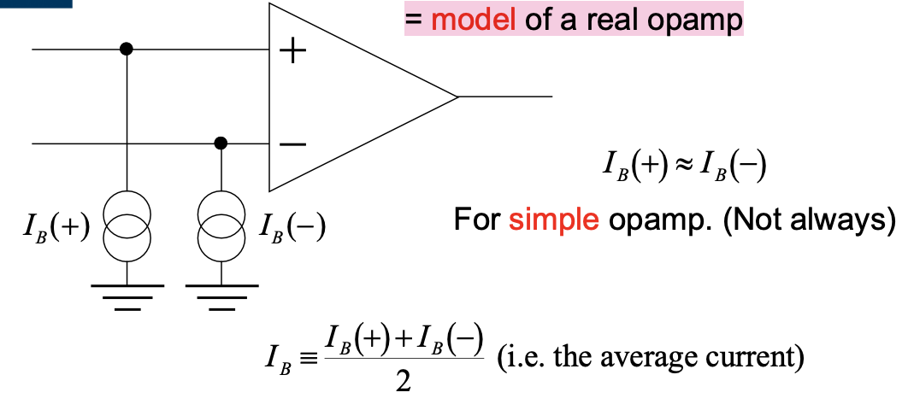

| Imperfect | Min 10fA    | Typical     | Max ~10$\mu$A |
| --------- | ----------- | ----------- | ------------- |
| $I_B$     | 1pA(MOSFET) | 100pA(JFET) | 10nA(Bipolar) |

# [Bias Current Blues](ESD/ESD_Static_Errors.md)
1. Bias Current Blues (1)
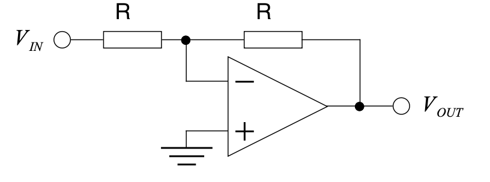
> Perfect opamp $V_{out}=-(V_{IN})$
> Independent of the value of R

2. Bias Current Blues (2)
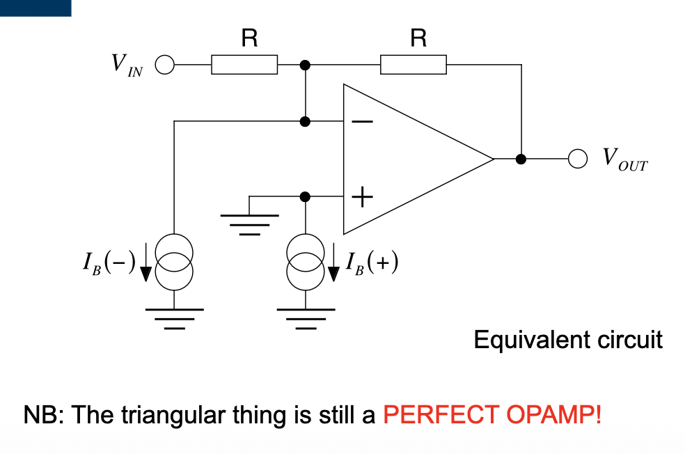
3. Bias Current Blues (3)
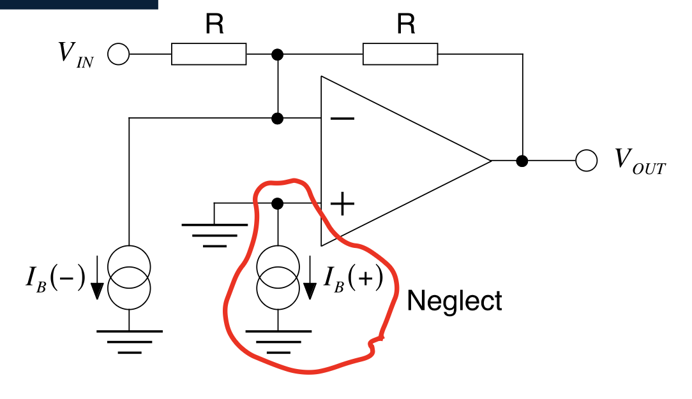
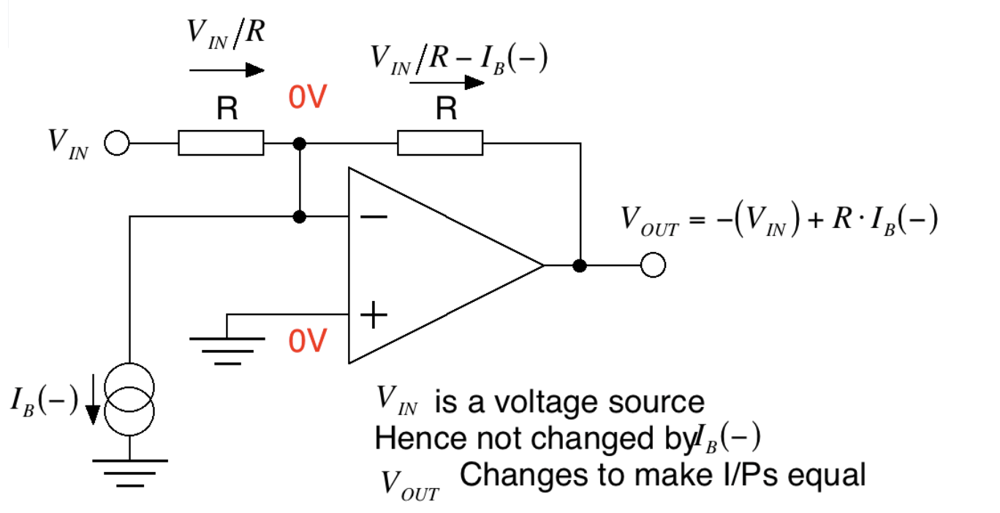
> Bias current adds error V of $R\times I_{B}(-)$ to O/P

4. Bias Current Bias (4): In the case of an inverting amplifier with gain
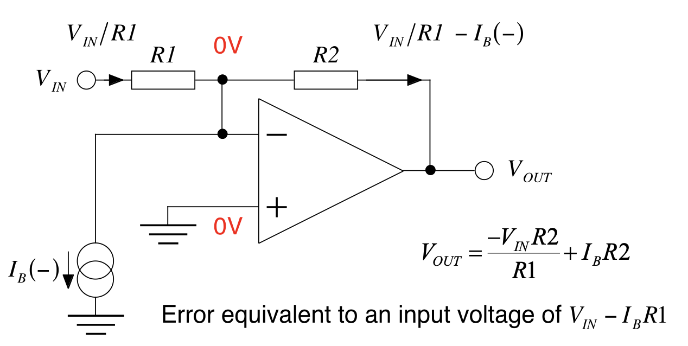
> Errors may be quoted as “Referred To Output” (RTO): $I_BR2$
> or “Referred To Input” (RTI): $-I_BR1$

5. Bias Current Bias (5)
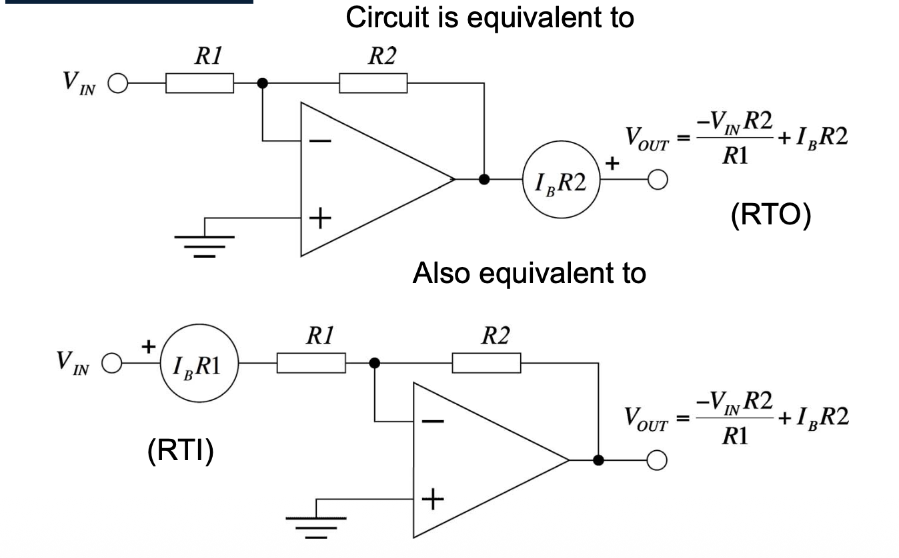

## A Cool Fix (If currents are equal)
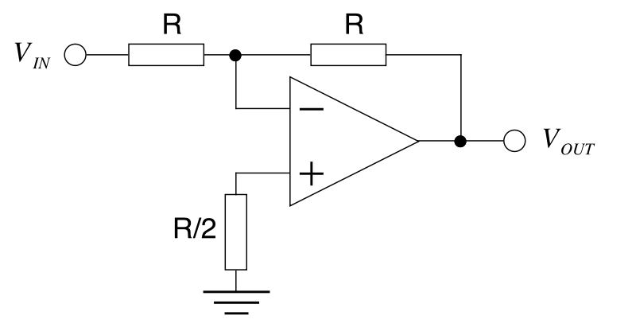
> Make DC resistances equal at both inputs
> (NOTE: Take care if there are inductors or capacitors about!)

## Compensating for Equal Bias Currents
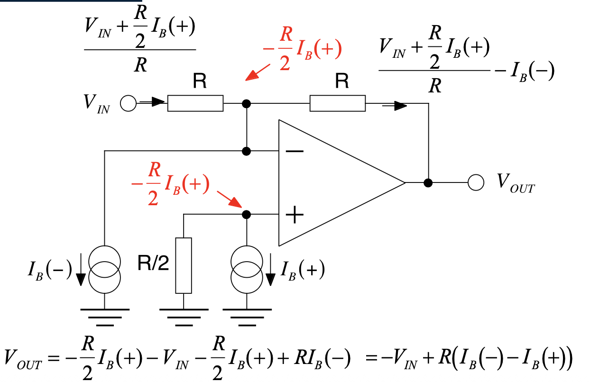
## Equal Bias Currents and Gain
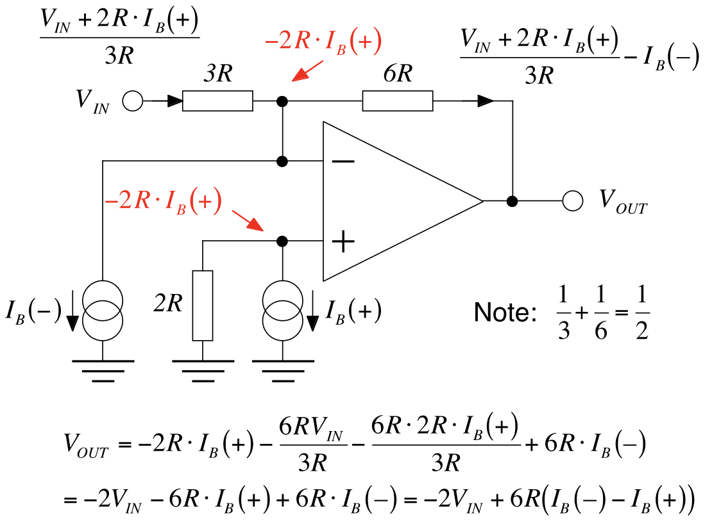
## Equal source impedances compensate for bias current in general
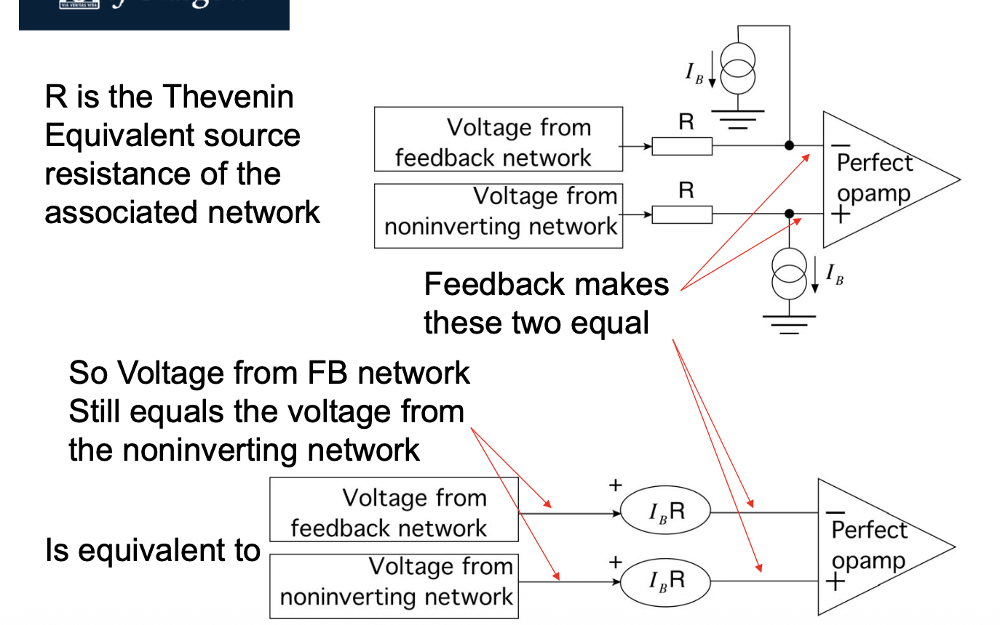

