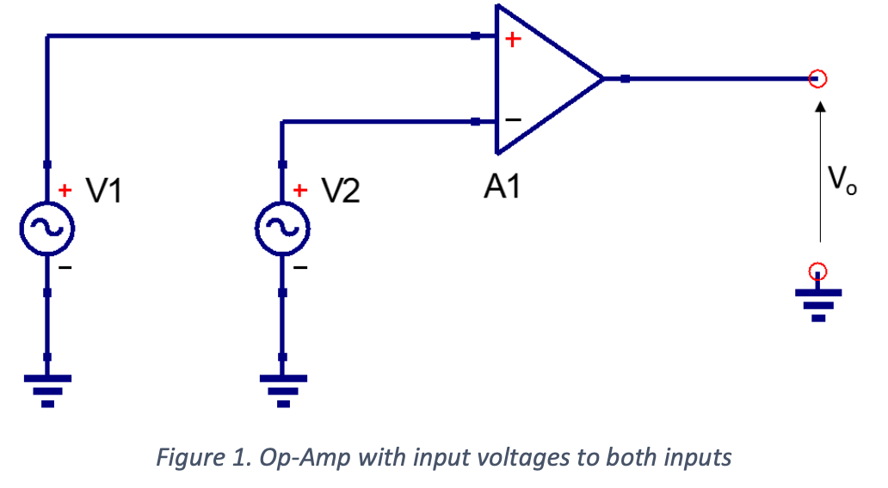
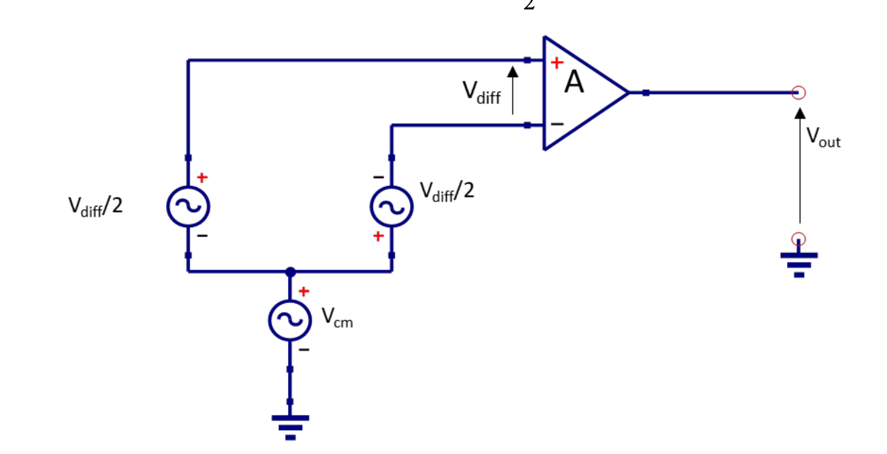
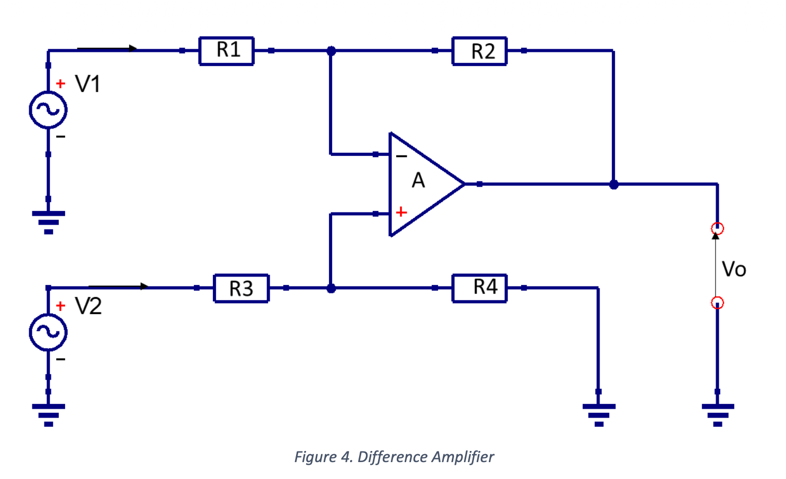
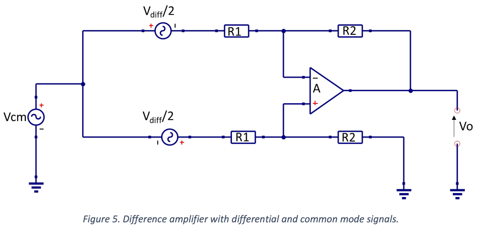
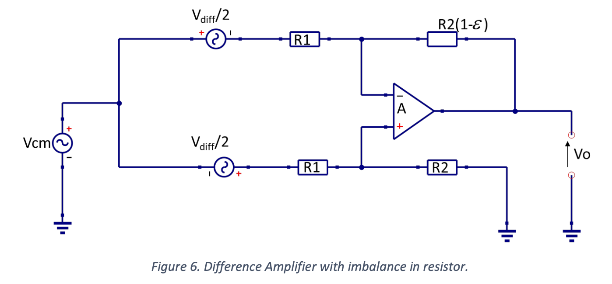
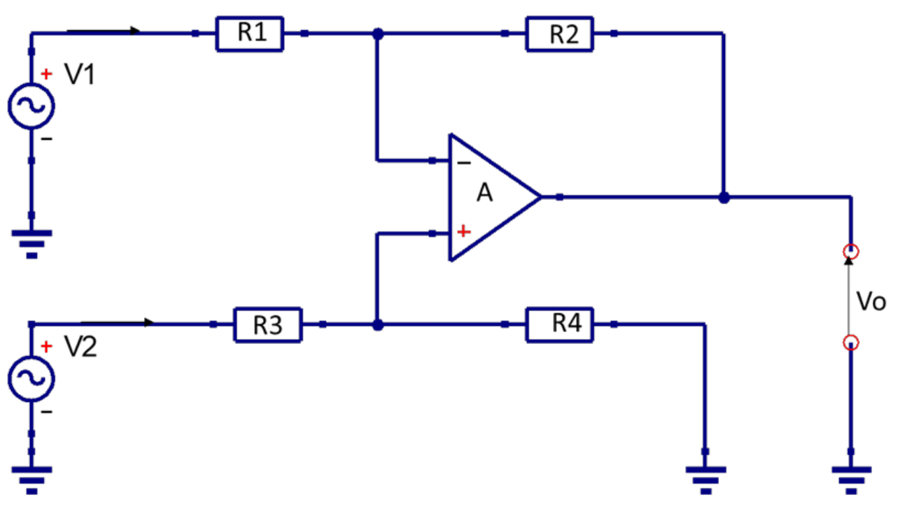
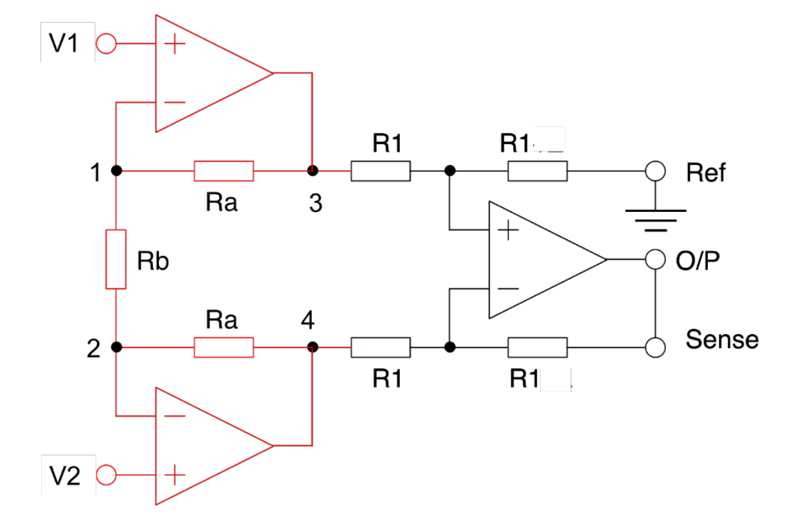

IA: Instrumental amplifiers
# Introduction
This section introduces the instrumentation amplifier (IA), a circuit built with multiple op-amps to cleanly amplify the difference between two signals. A single op-amp differential amplifier has a key flaw: low common-mode rejection (CMRR) due to feedback, which limits its performance. The IA is designed specifically to solve this issue. We will compare the two designs and look at examples. 
# [CMRR](ESD/ESD_CMRR_PSRR.md) and op-amps
CMRR measures an op-amp’s ability to reject signals common to both inputs. Ideally, it is infinite, as the output should remain unaffected when both inputs change equally—only the differential signal should be amplified.
For a differential input amplifier, common-mode voltage (Vcm) is defined as the average of the two input voltages. If we consider a differential amplifier, as shown in Figure 1, it can be seen that:
$$V_{cm}=\frac{V1+V2}{2}$$

If we now define V(+) and V(-) as the voltages at the non-inverting and inverting inputs to the Op-amp respectively then, considering Figure 2:
$$V_{cm}=\frac{V(+)+V(-)}{2},\ V(+)=V_{cm}+\frac{V_{diff}}{2},\ V(-)=V_{cm}-\frac{V_{diff}}{2}$$

$$V_{out}=A_{dm}(V_{diff})+A_{cm}(V_{cm})$$
> $A_{dm}$ is the differential mode gain and $A_{cm}$ is the common mode gain

Ideally, a differential input amplifier only responds to a differential input voltage, not a common mode voltage, so for an ideal op-amp:
$$CMRR_{ideal-OA}=\frac{A_{dm}}{A_{cm}}=\frac{\infty}{0}\to\infty$$
Now we have some idea what CMRR is we need to consider how it will affect a circuit. To do this we need a model. To produce a useful model the CMRR needs to be referred-to-input (RTI). This could be done by representing it as a voltage source in series with an input to the amplifier. The magnitude RTI is $V_{cm}/CMRR$. Now let’s look at a non-inverting buffer, as shown in Figure 3.
> (a) **由共模电压产生的输出误差**：$V_{out\ error\ cm}=A_{cm}*V_{cm}$
> (b) **将这个输出误差等效成一个“输入差分电压”引起的**：$$A_{dm}*V_{error\ rti}=V_{out\ error\ cm}=A_{cm}*V_{cm}$$

$$V_o=A(V(+)-V(-)), V(-)=V_o \pm\frac{V_{CM}}{CMRR}$$
So: 
$$ V_{cm}=\frac{V(+)+V(-)}{2},\ V(+)=V(-)\to V_o = A[V(+)-V_o\pm\frac{V(+)}{CMRR}],$$

As $A\to \infty$, 
$$\frac{V_{o}}{V(+)}\to1\pm\frac{1}{CMRR}$$
> shows that the larger the CMRR, the smaller the error

# CMRR of Difference Amplifiers
Consider a difference amplifier

Replace V1 and V2 with our alternate definition of the inputs, in terms of the differential and common mode signals. then it becomes apparent that if the amplifier is ideal the output should amplify the differential-mode signal and not the common mode.

$$V_1=V_{CM}-\frac{V_{diff}}{2},\ V_2=V_{CM}+\frac{V_{diff}}{2}, V_o=\frac{R_2}{R_1}(V_2-V_1)$$
$$V_o=\frac{R_2}{R_1}(V_{diff})$$
This is based on the premise that the op-amp is ideal and the resistors are balanced. Let us now see what happens if one of the resistors has an imbalance, $\epsilon$.

$$V_o=(V_{CM}-\frac{V_{diff}}{2})(-\frac{R_2(1-\epsilon)}{R_1})+(V_{CM}+\frac{V_{diff}}{2})(\frac{R_2}{R_1+R_2})(1+\frac{R_2(1-\epsilon)}{R_1+R_2(1-\epsilon)}) $$
Since $V_o=A_{diff}V_{diff}+A_{CM}V_{CM}$, then 
$$A_{diff}=\frac{R_2}{R_1}(1-\frac{R_1+2R_2}{R_1+R_2}\times \frac{\epsilon}{2}), A_{CM}=\frac{R_2}{R_1+R_2}\times \epsilon$$
So: $CMR=20\log_{10}(\frac{A_{diff}}{A_{CM}})$ can be calculated
If the imbalance is sufficiently small then the effect of $\epsilon$ on $A_{diff}$ can be neglected and, with some algebra:
$$CMR\approx 20\log_{10}[\frac{1+\frac{R_2}{R_1}}{\epsilon}]$$
> shows that the CMR will decrease as $\epsilon$ increases. It should be remembered that this shows the effect of the resistor network and assumes an ideal amplifier.
> (Note: Another possible source of CMRR degradation is the impedance of the reference pin. If there is an impedance here it will negatively affect the CMR.)

# Input Impedance into a Difference Amplifier

Consider Figure 4 again (re-drawn here as Figure 7). We will start by looking at the impedance ($R_{in2}$) seen by V2.
$$I_2=\frac{V2}{R3+R4},\ R_{in2}=R3+R4$$
The situation at the other input is much more complicated but considering the current flowing through R1 ($I_1$) we can write:
$$V1=I_1R1-V2\frac{R4}{R3+R4}$$
> From equation (18) the resistance seen by the source V1 (R1in) will not be the same as R2in, but a function of V2. This is important because the input sources must provide these input currents, which are different.

**In summary** then: We have seen that the simple differential amplifier has issues with reduced CMRR, due to resistor mismatch, and low and unmatched input impedances.
# Instrumentation Amplifier
Instrumentation amplifiers (IA) consist of using more than one op-amp as a difference amplifier and is primarily designed to combat this design flaw. Many IA consist of three op-amps, with two serving as a buffer for the two input circuits, and the third as a differential op-amp. 

This IA is in two stages, namely a buffering stage and a differential stage. The signals are applied one each to a non-inverting terminal of the op-amps in the first (buffering) stage. This allows the input sources to see a large resistance and thus reduce the current draw. In an ideal op-amp, the voltage at the non-inverting terminal is equal to that at the inverting terminal. Therefore, at points 1 and 2, the voltage is V1 and V2, respectively.
The second stage of the IA is a unity gain differential op-amp, with the inputs being the voltages at points 3 and 4, V3 and V4. The output of this stage is $V_{out}$:
$$V_{out}=(V_4-V_3)$$
Having the feedback resistors on both pins of the differential stage being equal makes this a unity-gain differential op-amp. To get the output in terms of the inputs, the relationship between V4 – V3 and V1 – V2 must be found. Between point 3 and 4, there are three resistors with no connection to ground. This causes the current through all three resistors, I, to be equal:
$$I=\frac{V_3-V_4}{2R_a+R_b}=\frac{V_1-V_2}{R_b}$$
Hence:
$$V_3-V_4=(V_1-V_2)(\frac{2R_a+R_b}{R_b})\to V_{out}=(V_1-V_2)(\frac{2R_a+R_b}{R_b})$$
Now we have an expression for the differential gain of the IA, but what about the common mode gain? Referring to the input (buffer) section in Figure (marked in Red) then let V1=V2. If we do this then the current through Rb will be zero since there is no potential difference across that resistor. This means that V3=V1 and V4=V2. The common mode gain for the input (buffering) stage is then given by:
$$Common\ mode\ gain=\frac{V_3-V_4}{V_1-V_2}=1$$
If we now consider the scenario depicted in Figure 6, where for the IA, R2=R1, then the differential gain for the IA would be given by:
$$A_{diff}=\frac{2R_a+R_b}{R_b}, A_{cm}=\frac{\epsilon}{2}$$
We can see that providing all the gain in the front end of the IA, so unity gain is required from the single op-amp of the output stage, will significantly improve the CMRR, which is now given by:
$$CMRR(IA)=\frac{A_{diff}}{A_{CM}}=\frac{4R_a+2R_b}{\epsilon R_b}$$
The CMRR of the IA will be significantly higher than that of a single op-amp differential amplifier, so there will be high attenuation of unwanted common mode signals. The CMR of an IA will typically be around 120 dB. This is very large, which means the output can be considered to be the desired signal.