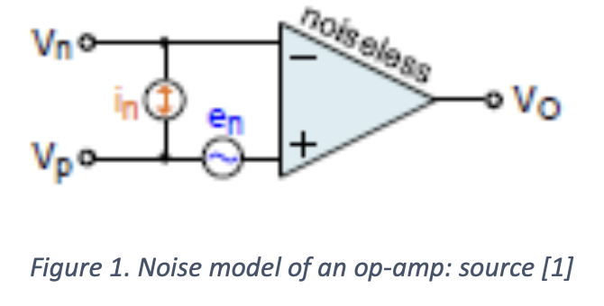
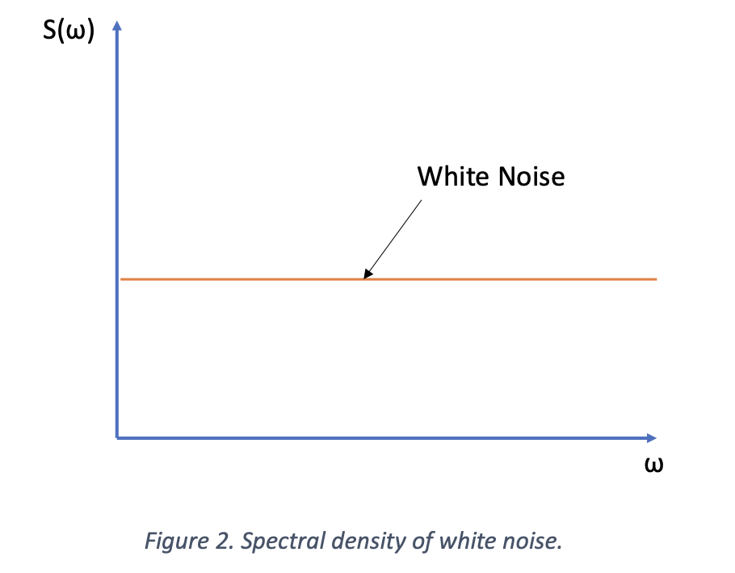
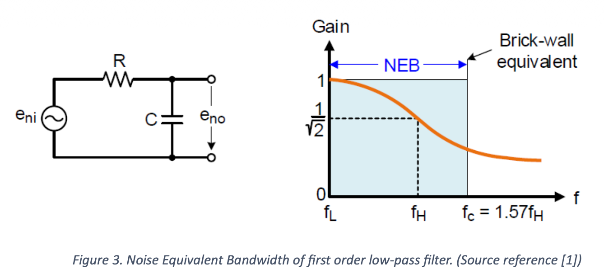
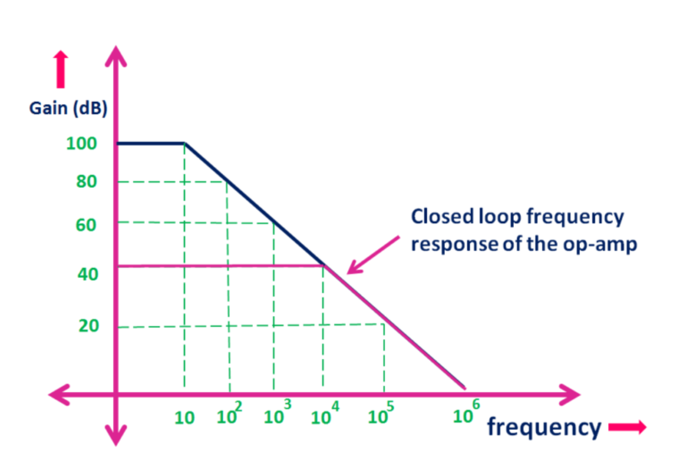
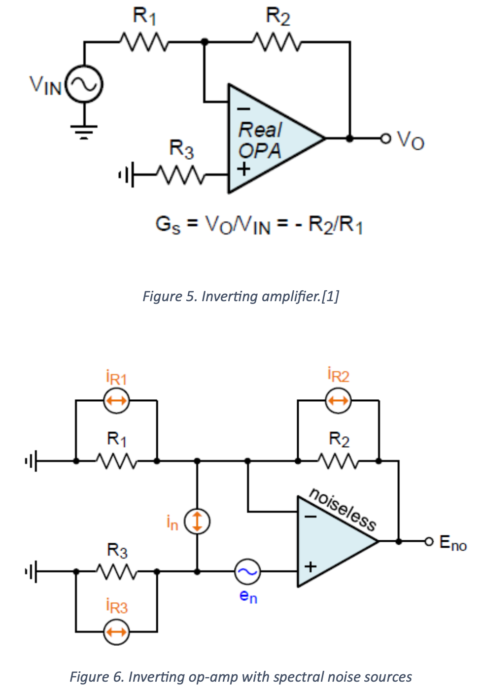

# Introduction
In this teaching block we will consider noise generated within op-amps. In an op-amp there are three noise sources: a voltage noise, which appears differentially across the two inputs and a current noise in each input. These sources can be considered independent of each other. In addition to these three internal noise sources, it is necessary to consider the thermal (Johnson) noise of the external resistors, which are used with the op-amp in the feedback network.
The causes of noise are random in nature and so are computed using root-mean-square (rms) values of noise voltages and noise currents. Op-amp data sheets specify noise voltage and current in the form of spectral densities. We will look at the necessary equations to convert noise spectral densities into rms noise.
An op-amp circuit exhibits random internal noise for two reasons:
1. Due to the random generation and recombination of electron-hole pairs in semi-conductors.
2. The thermal agitation of electrons in resistors. This is termed thermal or Johnson noise. The thermal agitation of an electron inside a resistor constitutes a minuscule current. These currents add up to a net current and, hence, a net voltage. This thermal noise voltage is zero on average but is constantly fluctuating due to the random distribution of the instantaneous magnitudes and directions of the individual electron currents.
# Signal-to-noise ratio
Noise has the effect of degrading the quality of a signal. It poses a limit on the size of the signal that can be successfully detected. A measure of specifying the signal quality in the presence of noise is the signal-to-noise ratio (SNR). The SNR defined as the ratio of the rms signal voltage, to the rms noise voltage in dB:
$$SNR=20\log_{10}\frac{rms\ signal\ voltage(V_s)}{rms\ noise\ voltage(E_n)}$$
# Op-amp noise model
Typically, Op-amp noise is modelled by a noiseless op-amp with two equivalent noise sources at the input. The voltage noise is considered as a voltage source with spectral density, en and the current noise as a current source with spectral density, in. This is depicted in Figure 1. It is convention to assign en to the non-inverting input.

# Thermal noise in resistors
All resistors have a thermal Johnson noise given by:
$$E_r=\sqrt{4RkT\Delta f}$$
> k: Boltzmann's Constant $1.38\times 10^{-23}J/K$
> T: absolute temperature in Kelvin
> $\Delta f$: bandwidth
> R: the resistance value
> Note that the unit for thermal noise is $V/\sqrt{Hz}$. (Strictly speaking this is the thermal noise spectral density)

This is intrinsic to all resistors, so it is not possible to obtain resistors which do not have Johnson noise, unless you operate a 0 Kelvin.
# What do we mean by bandwidth
First, we need to define something called white noise. White noise is noise that has a flat spectral density. That means that it has the same magnitude across the entire electromagnetic spectrum, as shown in Figure 2.

If we ran white noise through a first order low-pass filter with $f_H$ as its -3dB frequency the noise will behave as if filtered by a “brick-wall filter” with a higher cutoff frequency than the -3 dB frequency. In this case $f_c = 1.57f_H$. The increased bandwidth is termed the white Noise Equivalent Bandwidth (NEB). This is depicted in Figure 3.

If an amplifier with purely resistive feedback is considered then the closed-loop gain represents a first order low-pass with a -3dB bandwidth, $f_H$. This amplifier would then have a NEB with a cutoff frequency, $f_c$, of 1.57$f_H$.
## In practise how do we find NEB for a given op-amp?

For the ideal op-amp, the gain would be infinite, and it has infinite bandwidth. Since no op-amp is ideal it would have a finite bandwidth and a finite gain. An op-amp would have a flat voltage gain up to a certain frequency after which it would fall at 20 dB per decade, as we would expect from a first order filter. Figure shows the closed loop frequency response of an op-amp. The op-amp considered here has a gain of 100 dB. The frequency at which the gain falls by 3 dB is the cut-off frequency. (Note: Normally it is termed fc but to be consistent with the previous section we will term it fH.) We then see a first order drop in gain of 20 dB per decade until we reach unity gain, in this case at 1 MHz. The point of unitary gain is termed the Gain-Bandwidth (GBW). If a closed loop is used, as in an inverting or non-inverting amplifier, the gain will be lower but the cut-off frequency will be higher. The purple line shows am amplifier with 40 dB (x100) gain, and an fH of 10 kHz. If is common for the GBW to be given in data sheets, since it is a constant for all gain, so the Noise Equivalent Bandwidth (NEB) can be found from:
$$NEB=1.57\times\frac{GBW}{Noise\ Gain}$$
More accurately we should write equation 3 as:
$$NEB=n\times\frac{GBW}{Noise\ Gain}$$
> where n is the brick-wall factor for a given filter order. The effective order of the filter will increment every time an amplifier stage is added (so for two cascaded amplifiers the order is 2). Table will give the value of n for filter orders up to 5. In practise, it is unlikely we would want to cascade for than 2 amplifiers.

| Filter order | n    |
| ------------ | ---- |
| 1            | 1.57 |
| 2            | 1.22 |
| 3            | 1.16 |
| 4            | 1.13 |
| 5            | 1.12 |
# Total RMS input noise, $E_{ni}$
In this analysis we will consider an inverting amplifier as shown in Figure 5. We will then add the sources of noise, Figure 6, and look at how they can be calculated. Some approximations are used and these will be justified.

## Thermal noise due to $R_1$ and $R_2$
$R_1$ and $R_2$ are connected in parallel and so the RMS noise equivalent voltage is:
$$E_{RP}=\sqrt{4KT\times 1.57f_H\times(R_1||R_2)}$$
## Thermal noise due to $R_3$
It can be assumed here that the value of R3 is the same as R1||R2. Therefore, the RMS noise equivalent voltage due to R3 will be the same as for R1 and R2.
$$R_3=E_{RP}=\sqrt{4KT\times 1.57f_H\times(R_1||R_2)}$$
## RMS noise voltages that are due to op-amp current noise
At the negative input of the op-amp this noise voltage, $E_{nn}$, is the product of the rms noise current, $I_n$, and the parallel resistance R1||R2.
$$E_{nn}=R_1||R_2 i_{nw}\sqrt{1.57f_H}$$
At the positive input of the op-amp this noise voltage, $E_{np}$, is the product of the rms noise current, $I_n$, and R3.
$$E_{ np}=E_{nn}=R_1||R_2 i_{nw}\sqrt{1.57f_H}$$
## RMS input noise voltage due to $e_n$
We can find this by:
$$E_n=e_{nw}\sqrt{1.57f_h}$$
$E_{ni}$ can now be found by summing all the noise voltages given by equations:
$$E_{ni}=\sqrt{E_{RP}^2+E_{R3}^2+E_{nn}^2+E_{np}^2+E_n^2}=\sqrt{1.57f_H(8kTR_P+2R_P^2i_{nm}^2+e_{nw}^2)}$$
> $R_P=R_1||R_2$

# Total rms output noise voltage
To find the output noise voltage the Eni has to be multiplied by the noise gain. It is important to realise that $E_{ni}$ is always referred to the non-inverting input, so the noise gain will be the gain of a non-inverting amplifier, so:
$$E_{no}=E_{ni}(1+\frac{R_2}{R_1})$$
