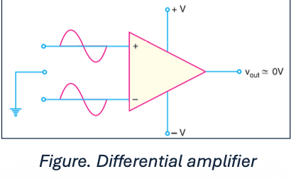

CMRR (Common-Mode Rejection Ratio) and PSRR (Power Supply Rejection Ratio)
# CMRR
- A differential amplifier should have high differential voltage gain ($A_{DM}$) and very low common-mode voltage gain ($A_{CM}$). The ratio $A_{DM}/A_{CM}$ is CMRR i.e.,
$$CMRR=\frac{A_{DM}}{A_{CM}}$$
- Often, the CMRR is expressed in decibels (dB). CMRR in dB is given by:
$$CMRR_{dB}=20\log_{10}\frac{A_{DM}}{A_{CM}}=20\log_{10}CMRR$$
- CMRR is the ability of a differential amplifier (DA) to reject the common-mode signals.
- The larger the CMRR, the better the DA is at eliminating common-mode signals.
## Importance of CMRR
Let’s assume the differential amplifier in the figure has a differential voltage gain of 1500 (i.e., $A_{DM}$ =1500) and a common-mode gain of 0.01 (i.e., $A_{CM} = 0.01$)
$$CMRR=\frac{1500}{0.01}=150,000$$
> This means that the output produced by a difference between the inputs would be 150,000 times as great as the output produced by a common-mode signal
> The ability of the DA to reject common-mode signals is one of its main advantages

Common-mode signals are usually undesired signals caused by external interference.
**For example**, any RF signals picked up by the DA inputs would be considered undesirable. The CMRR indicates the DA’s ability to reject such unwanted signals.
## Not a concern in the inverting amplifier configuration
- In general, CMRR is not of concern in the inverting amplifier configuration.
- For a Non-inverting amplifier, both inputs can have some common-mode voltage, so the finite CMRR of the op-amp matters, we see a small error (for example, a few hundred microvolts when you apply a 10 V step).
- For an inverting amplifier, because of the virtual ground effect, both op-amp inputs stay very close to ground (0 V). That means the common-mode voltage is essentially zero. Since there’s no significant common-mode signal, CMRR doesn’t really come into play.
# Power Supply Rejection Ratio
- If the supply of an op amp changes, its output should not, but it typically does.
- The PSRR represents a change in the input offset voltage that occurs in response to changes in supply voltage.
- A high PSRR is desirable because it means less leakage of supply voltage changes to the output.
- The PSRR is defined as the ratio of the gain due to changes in supply voltage to the differential voltage gain. Normally, PSRR is calculated by measuring the output offset voltage while changing the supply voltage.
## PSRR or PSR
- If a change of X volts in the supply produces an output voltage change of Y volts, then the PSRR on that supply (referred to the output, RTO) is X/Y.
- Dimensionless ratio (X/Y) is generally called PSRR, and Power Supply Rejection (PSR) if it is expressed in dB.
- PSRR and PSR are almost always used interchangeably, and there is little standardisation within the industry.
- PSRR or PSR can be referred either to the output (RTO) or the input (RTI). The RTI value can be obtained by dividing the RTO value by the amplifier gain.
- In traditional op-amps, this would be the noise gain. The data sheet should be read carefully, because PSR can be expressed either as an RTO or RTI value.