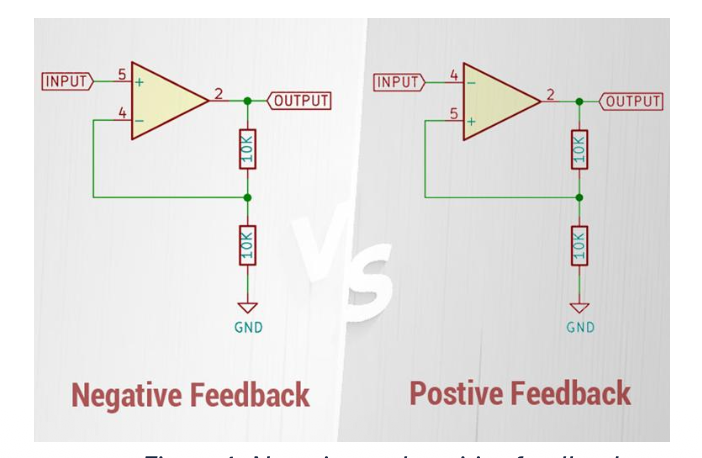
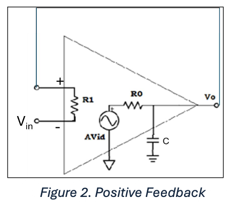
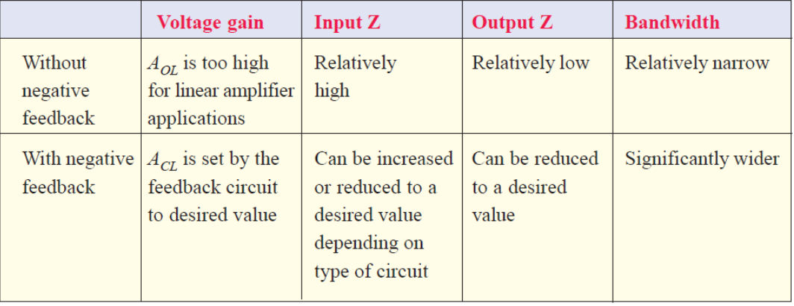

Feedback in an op-amp is the technique of taking a portion of the output signal and connecting it back to the input of the amplifier. In simple terms :
- An op-amp has an extremely high voltage gain (**Open-loop gain**). Without feedback, even a tiny voltage difference between the two inputs would drive the output to its maximum limit (saturation), making it unusable as a linear amplifier.
- **Feedback** is the external circuit component (usually a resistor network) that bridges the output back to one of the inputs. It creates a **closed-loop system**, which is necessary for most linear op-amp applications.
## Types of Feedback
- Two types of feedback: Positive feedback, Negative  feedback
- **Negative feedback** takes a part of the output and subtracts it from the input in such a way that the output is in equilibrium with the input. This means that any change in the input is followed by a similar change in the output.
## Negative and positive feedback
Negative feedback:
- Negative feedback = portion of output is subtracted from input.
- For Vin = 1 V, op-amp maintains V- ≈ V+ (0 V difference).
- With two 10 kΩ resistors, circuit gain = 2.
- Output is stable and predictable.

Positive feedback:
- **Positive feedback** = output adds to input.
- Example:
Inverting input higher than non-inverting → output switches low (≈ -5 V).
Non-inverting node ≈ -2.5 V; output stays at -5 V until Vin < -2.5 V → then flips to +5 V.
- Circuit cannot maintain equilibrium → always saturates at supply rails.
- Hence, **positive feedback cannot be used in amplifiers** (used only in comparators/oscillators).
# Analysis using Laplace Transforms
Positive feedback
- Equivalent circuit for an op-amp with **positive feedback**.

> R1 is very large, ideally infinite, R0 is very small, ideally 0 and the capacitor (C) determines the high frequency cut-off.

- Voltage difference across $R_0$ is given by $𝑨\times 𝑽_{𝒊𝒅} − 𝑽_𝒐$, where A is the open loop gain of the op-amp and $V_{id}$ is the voltage between the input pins. In addition, the current flowing through $R_0$ must charge, or discharge, the capacitor.
- The differential equation for output voltage is then given by:
$$R_0C\frac{dV_o}{dt}-(A-1)V_o=-AV_{in}\ (1.1)$$
- The open loop gain of an op-amp can be considered to is very large, and the initial input and output voltages are zero. Equation (1.1) then transforms to:
$$R_0Csv_o(s)-Av_o(s)= -Av_{in}(s)\ (1.2)$$
- This can be re-arranged to give:
$$v_o(s)=-\frac{A}{R_oC}\frac{v_{in}(s)}{s-A/R_0C}\ (1.3)$$
- If we have a unit step input, that is an input of 1 V for t >0, then $v_{in}(s)=\frac{1}{s}$so:
$$v_o(s)=-\frac{A}{R_0C}\frac{1}{s(s-\frac{A}{R_0C})}\ (1.4)$$
- An inverse Laplace transform of equation (1.4) gives the output voltage in the time domain:
$$V_o(t)=1-e^{\frac{A}{R_0C}t}\ (1.5)$$
- This equation indicates that the response to a 1V input voltage is the output tending to minus infinity. In practice, this is limited to the negative DC voltage pin.
Negative Feedback
- Consider negative feedback, as shown in Figure 3, then $V_{id}=V_{in}-V_o$ and we get a differential equation for the output voltage of:
$$R_0C\frac{dV_o}{dt}+(A+1)V_o=-AV_{in}\ (1.6)$$
- This will lead to an equation in the s-domain given by:
$$v_o(s)=\frac{A}{R_oC}\frac{1}{s(s+A/R_0C)}\ (1.7)$$
- The time domain response to a unit step is then given by:
$$V_o(t)=1-e^{-\frac{A}{R_0C}t}$$
This indicates that for negative feedback the steady state solution is an output voltage of 1 V, which is what would be expected from a voltage follower.

## Summary
- When we draw a schematic of an op-amp amplifier circuit (inverting, non-inverting, differential or instrumentation) we must **never** use positive feedback.
- Normally, the circuit analysis that we do is the steady state analysis. It will not be valid for positive feedback.
- If we use positive feedback in an amplifier circuit in the lab the amplifier will never work, because the circuit will not be stable.
### Why Op-Amp with Negative Feedback
- An Op-amp is almost always operated with negative feedback, i.e., a part of the output is fed back in phase opposition to the input
- Reason is simple, since the open-loop gain voltage gain of the Op-amp is very high (> 100,000), therefore, an extremely small voltage input drives the op-amp into the saturated output stage.
- For instance, $V_{in} = 1mV$ and $A_{ol} = 100000$, Then,
$$v_{out}=A_{OL}v_{in}=(100,000)\times(1mV)=100V$$
- Since output can’t reach 100V (最多能达到控制放大器的电压), it is driven deep into saturation and the device becomes non-linear.
- With negative feedback, the voltage gain can be reduced and controlled so that op-amp can function as a linear amplifier.

