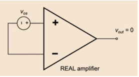
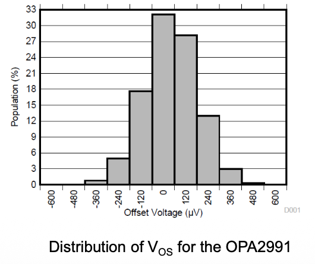
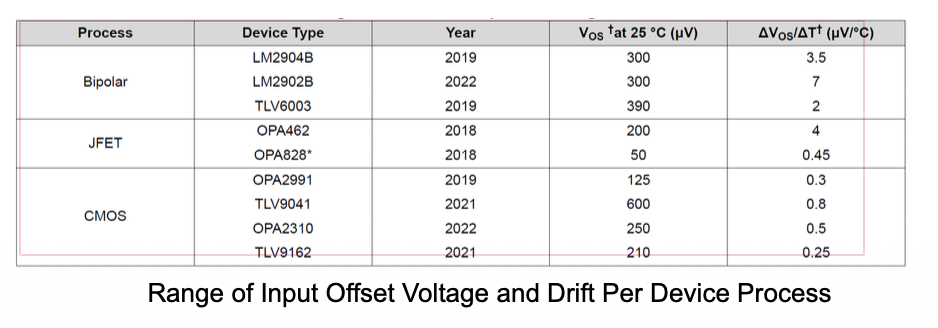
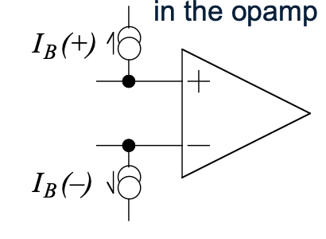
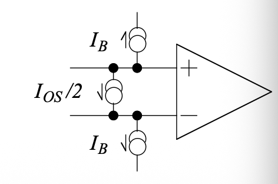
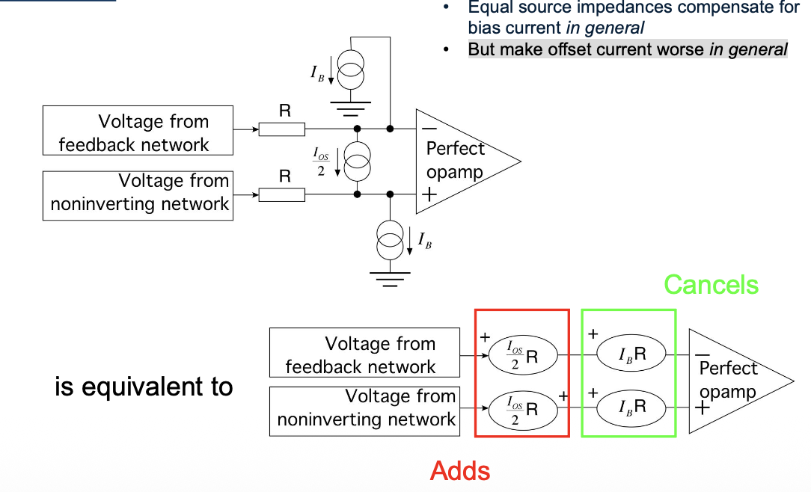
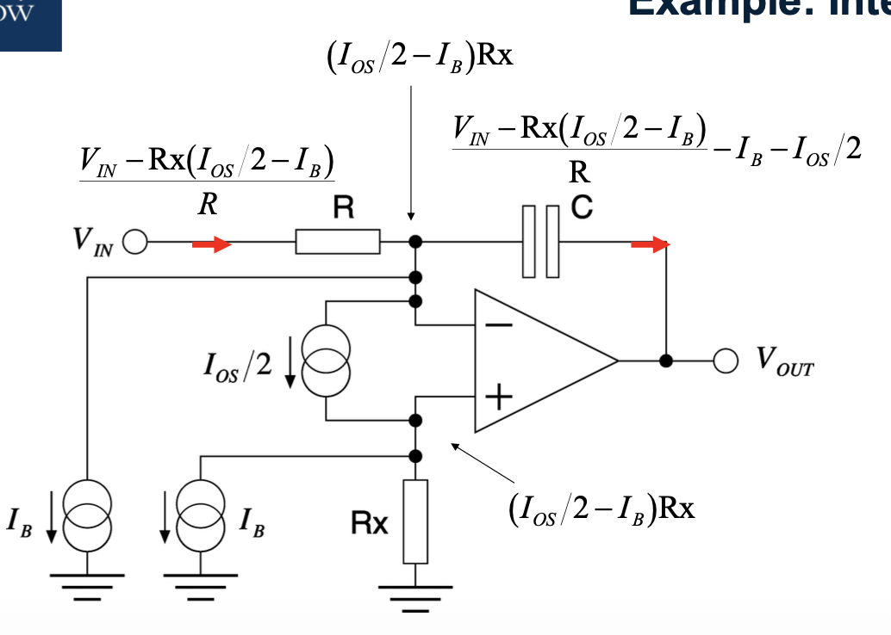
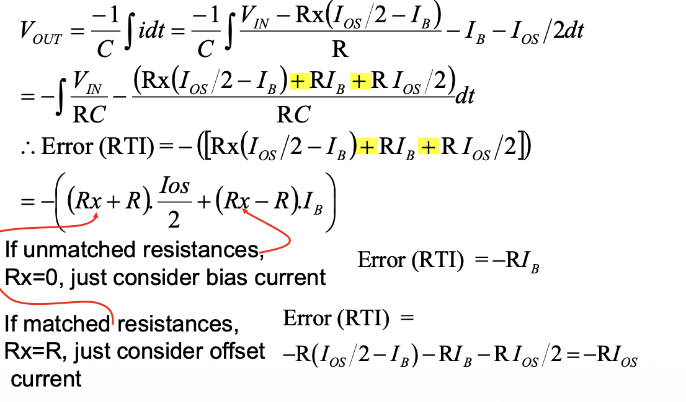

# Input Offset Voltage
1. $V_{OS}$ is defined as the voltage that must be applied between the two input terminals of the op-amp to obtain zero volts at the output.

2. $V_{os}$ is the input voltage required to make $V_{out} = 0$.
3. Symbolically represented by a voltage source that is in series with either the positive or negative input terminal.
4. Is considered to be a DC error and is present from the moment that power is applied until it is turned off, with or without an input signal.
5. Occurs during the biasing of the op-amp and its effect can only be reduced, not eliminated.
6. Can be either negative or positive in polarity and can vary from device to device (die to die) of the same wafer lot.
- Typically in the range of $10\mu V\ to\ 10mV$.

## Cause of $V_{os}$
- Mostly due to the inherent mismatch of the input transistors and components during fabrication of the silicon die.
- Stresses placed on the die during the packaging process have a minor contribution.
- These effects collectively produce a mismatch of the bias currents that flow through the input circuit, and primarily the input devices, resulting in a voltage differential at the input terminals of the opamp.
- $V_{OS}$ has been reduced with modern manufacturing processes through increased matching and improved package materials and assembly.
## Manufacturing process
- Three general manufacturing processes : CMOS, JFET, and bipolar.
- CMOS devices typically have the lowest $V_{OS}$ of the three, and they have the least drift.
- JFET devices have the worst $V_{OS}$ and temperature drift.
- Bipolar devices have a $V_{OS}$ that is close to that of CMOS devices, and a low temperature drift.

## Effect of Input offset voltage
- Reduce/minimize $V_{OS}$ - can only be reduced, not eliminated.
- Mismatch mainly due to:
> Doping variations, Lithographic errors, Packaging and local stress

# Input Offset Currents
The difference between the bias currents is the **_Offset Current:_**
$$I_{OS}=|I_{B}(+)-I_B(-)|$$
> Note that matching DC resistance compensates for $I_B$ not $I_{OC}$
> Matched resistor trick is only good to about 5% of the total error

Many modern opamps correct for bias current
Exceptions are
- Cheap opamps
- Fast opamps (esp. current feedback)
- Some specialised opamps (e.g. audio)
In the worst case the currents flowing into the inputs are equal and opposite:
$$I_{OS}≤2I_{B}$$
If bias current has been corrected only the error is left
=> Balancing resistors makes things worse
## Fixed Model
The model for current errors in the opamp is now:
$$I_B(+),\ I_B(-)$$

But we express $I_B(–)$ and $I_B(+)$ in terms of their average and difference:
$$I_{OS}=|I_B(+)-I_B(-)|,\ I_B=\frac{I_B(+)+I_C(-)}{2}$$

> This is how the currents are defined in data sheets

> Don’t try to combine bias and offset current to work out specific values of current: these are only limiting specifications:

## FET
1. FET input opamps have very low bias current. But bias current is often exponential with temperature.
2. Bipolar opamp’s bias much more stable with temperature
3. Important point if designing for rugged environment
- Automotive
- Military / Aerospace
- But not for normal domestic / lab conditions!

## Difference between Offset and Bias current
If impedances are (very) unbalanced, use bias current spec.
If impedances are balanced, use offset current spec.
Example: Integrator

